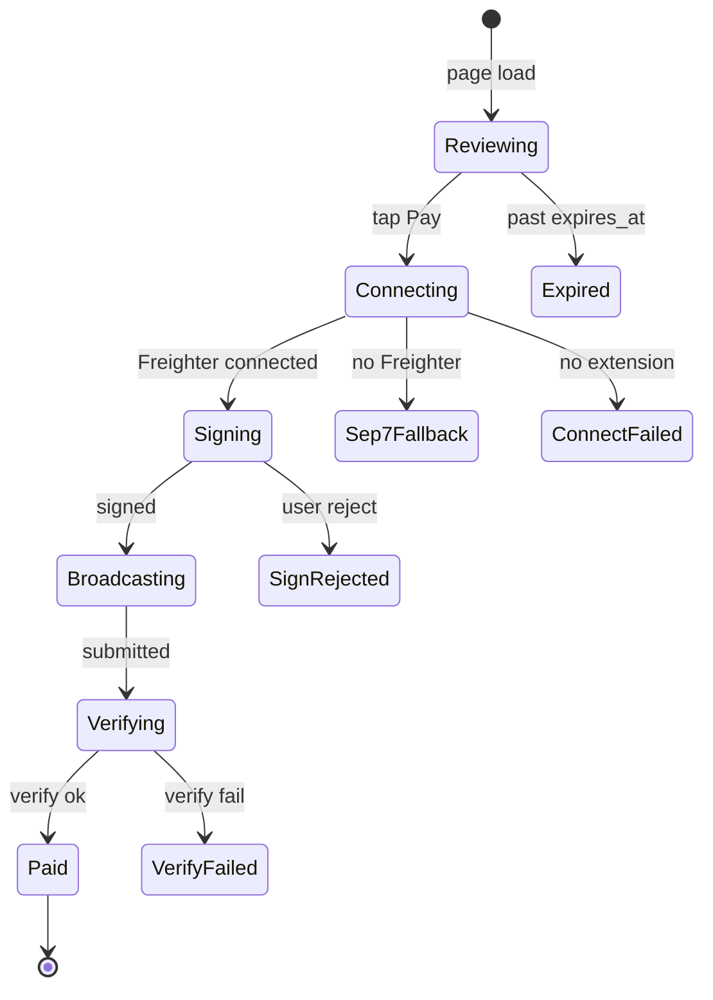

# Project ZERO — UX/UI Design Specifications

> **Status:** Approved for implementation  
> **Audience:** Product, design, and Composer 2.5 executor agents  
> **Last updated:** 2026-07-10  
> **Related:** [`mvp-implementation.md`](./mvp-implementation.md), [`mvp-roadmap.md`](./mvp-roadmap.md), [`ux-ui-implementation-plan.md`](./ux-ui-implementation-plan.md)

---

## 1. Purpose

This document defines the approved UX/UI direction for Project ZERO after auditing every current route, reconciling MVP documentation against the live codebase, and researching comparable fintech and Stellar payment products.

**Goals:**

1. Evolve the existing dark + emerald identity into a polished, trust-first fintech experience.
2. Fix functional blockers before visual polish so redesigned screens reflect real behavior.
3. Make merchant operations efficient on desktop and customer checkout frictionless on mobile.
4. Preserve the security model: wallet keys never leave the customer device; settlement requires four-axis on-chain verification.

**Non-goals:**

- Full visual rebrand or new typography family.
- New product scope (subscriptions, multi-entity, mainnet switch).
- Replacing shadcn/ui or rewriting backend settlement logic beyond UX-facing fixes.

---

## 2. Product context

**Product:** Project ZERO — credentialless commerce for MSMEs and social sellers on Stellar Testnet.

**Core flow:**

```
Merchant creates invoice → share QR/link → customer reviews in wallet →
authorizes payment → Stellar settles → server verifies → dashboard marks paid
```

**Primary personas:**

| Persona | Context | Priority device |
|---------|---------|-----------------|
| Merchant / seller | Creates invoices, tracks payments, manages products | Desktop-first |
| Customer / payer | Opens shared link, pays with Freighter or SEP-7 wallet | Mobile-first |
| New merchant | Registers, onboards Stellar public key | Mobile + desktop |

**Approved direction:** Trust-first merchant operations + focused customer checkout (not commerce-heavy, not web3-expressive).

---

## 3. Current-state audit

### 3.1 Documentation drift (must correct in UI copy)

The MVP roadmap and several UI strings describe Phase 1–3 gaps that are already implemented in code. Redesign copy must reflect live behavior.

| Location | Stale claim | Reality |
|----------|-------------|---------|
| `docs/mvp-roadmap.md` | Wallet, verify, settlement all missing | Largely implemented |
| `src/app/page.tsx` | Freighter connects "in Phase 3" | Live on `/pay/[id]` |
| `src/app/(dashboard)/payments/page.tsx` | "Phase 3 adds verification writes" | `mark_payment_paid` RPC exists |
| `src/app/(dashboard)/dashboard/page.tsx` | Transactions "appear in Phase 3" | Populated after settlement |
| `README.md` | Verify returns 501; Freighter inactive | Real verify + wallet flow |

### 3.2 Route inventory and functional status

| Route | Layout | Status | Key gaps |
|-------|--------|--------|----------|
| `/` | Root | Implemented | Stale phase copy; fake QR grid; no shared marketing header |
| `/login` | Root | Implemented | Ignores `?next=` from auth proxy; no loading state |
| `/register` | Root | Implemented | Same feedback gaps as login |
| `/dashboard` | Dashboard | Partial | KPIs from 5-row sample; no QR; silent redirect feedback |
| `/invoices` | Dashboard | Partial | No merchant QR; raw `<select>`; misleading hidden destination field |
| `/products` | Dashboard | Partial | Create-only; no edit/deactivate; silent feedback |
| `/payments` | Dashboard | Partial | Stale empty copy; raw hash rows only |
| `/pay/[id]` | Root | **Blocked** | XDR uses merchant as source; expired → 404; hardcoded light success colors |

### 3.3 Critical functional defects (Phase 0 blockers)

These must be fixed before or alongside UI work. They are not cosmetic.

#### F1 — Payment XDR source account is wrong

**File:** `src/lib/stellar/build-payment.ts` (lines 33–34)

```typescript
const source = new Account(destination, "0");
```

Stellar requires the **customer wallet** as transaction source with a live sequence from Horizon. Freighter `signTransaction` signs the envelope; it does not replace the source account. Using the merchant destination with sequence `"0"` makes valid customer signing impossible.

**Required fix:** Accept `sourcePublicKey`, load account from Horizon, build `TransactionBuilder` from that account.

#### F2 — Dashboard KPIs are inaccurate

**File:** `src/app/(dashboard)/dashboard/page.tsx` (lines 38–55)

Pending/paid counts are computed from the latest 5 rows, not aggregate queries. A merchant with 20 pending invoices may see `3`.

**Required fix:** Use `count` queries or a single aggregate SQL/RPC call.

#### F3 — Flaky test on cold import

**File:** `src/actions/payment-requests.test.ts`

Default `npm test` times out on first import (~6s); isolated rerun passes. Vitest has no `setupFiles`, no jsdom (per MVP Track D1 plan).

#### F4 — Silent form feedback

Server actions redirect with `?error=` and `?created=` query params, but dashboard/invoices/products pages never read them. Users get no success or failure confirmation.

#### F5 — Login ignores return URL

**Files:** `src/proxy.ts`, `src/actions/auth.ts`

Proxy sets `?next=` on auth redirect; login always goes to `/dashboard`.

#### F6 — Expired invoice UX

**File:** `src/app/pay/[paymentRequestId]/page.tsx` (lines 26–28)

Expired/cancelled requests call `notFound()` instead of a friendly unavailable state.

#### F7 — Misleading wallet error copy

**File:** `src/components/payment/payment-request-card.tsx` (lines 218–220)

Post-broadcast verification failures still say "funds have not been moved if signing was rejected" — incorrect after a successful broadcast.

#### F8 — Merchant dashboard missing QR

MVP Track D2 requires QR per invoice on merchant dashboard. QR exists only on customer `/pay` page.

#### F9 — Missing route states

No `loading.tsx`, `error.tsx`, or `not-found.tsx` anywhere under `src/app/`.

#### F10 — Non-XLM invoice form gap

Invoice/product forms expose free-text `assetCode` but no `assetIssuer` field for credit assets, while schema requires issuer for non-XLM.

### 3.4 Orphan / dead UI components

| File | Issue |
|------|-------|
| `src/components/payment/payment-page-placeholder.tsx` | Never imported |
| `src/components/dashboard/dashboard-placeholder.tsx` | Never imported |
| `src/components/layout/site-header.tsx` | Exists but unused on public routes |
| `src/components/forms/auth-shell.tsx` | Exists but login/register don't use it |

### 3.5 What already works (do not regress)

- Server-bound `stellar_destination` in `createPaymentRequest`
- Crypto-random memo via `randomBytes`
- Real `verifyPaymentByHash` four-axis check
- `POST /api/stellar/verify` → `mark_payment_paid` RPC
- Dashboard status polling via `PaymentStatusBadge`
- SEP-7 URI builder + fallback QR when Freighter absent
- pg_cron expiry migration
- Status endpoint rate limiting
- RLS + pgTAP test file

---

## 4. Design research synthesis

Research scraped via Firecrawl from Stripe, Coinbase Business, Ecommpay, Request Finance, Freighter, and Stellar ecosystem references.

### 4.1 Patterns to adopt

| Source | Pattern | Application in Project ZERO |
|--------|---------|----------------------------|
| **Stripe Payment Links** | Single-purpose checkout; branded header; explicit deactivated/expired states; minimal fields | Customer `/pay` page: one dominant CTA, clear invoice summary, expired state copy |
| **Coinbase Business** | Invoicing + Payment Links as parallel simple concepts; trust/security callouts | Merchant invoices list: share link + QR actions; "verified on-chain" badges |
| **Ecommpay** | Real-time financial overview; payment-link management; transparent reporting | Dashboard KPI cards + recent activity with live status |
| **Request Finance** | Clarity, control, audit trails; security confidence blocks | Payment history with explorer links; wallet connection trust block on checkout |
| **Freighter / Stellabill** | Dark wallet UI; secure-connection disclosure; mobile-responsive modal | Checkout wallet panel: network badge, connected address, SEP-7 fallback |

### 4.2 Patterns to avoid

- Dense crypto jargon on merchant screens (keep chain details collapsible).
- Multiple competing CTAs on checkout (one primary: Pay with Freighter).
- Fake UI placeholders (landing page QR grid) that don't reflect real data.
- Phase-number copy that implies unfinished features.

### 4.3 Competitive positioning

Project ZERO sits between **traditional invoice tools** (Stripe, Wise) and **crypto-native finance** (Request Finance, Coinbase Business). The UI should feel like a fintech operations dashboard with Stellar-specific trust cues only where they aid payment confidence.

---

## 5. Design principles

1. **Trust before novelty** — Security and verification states are visible, not hidden behind technical detail.
2. **Truthful UI** — Every label, empty state, and error message reflects actual system behavior.
3. **Progressive disclosure** — Show amount, merchant, and pay action first; memo, destination, and network details on expand.
4. **Operations clarity** — Merchants scan status, amounts, and links quickly; tables are filterable and scannable.
5. **Mobile checkout, desktop operations** — Responsive everywhere, but optimize density per persona.
6. **Accessible by default** — Semantic HTML, focus management, `aria-live` for async status, 44px touch targets on mobile.
7. **Token-driven styling** — No hardcoded `green-*`, `zinc-*`, or `bg-white`; use design tokens for dark and light.

---

## 6. Visual design system

### 6.1 Brand evolution (not rebrand)

Retain:
- **App name:** Project ZERO
- **Tagline:** Credentialless commerce for local merchants
- **Font:** Geist Sans + Geist Mono
- **Primary hue:** Emerald green (`oklch` ~150°)
- **Default theme:** Dark

Evolve:
- Deeper graphite surfaces for depth
- Restrained cyan accent for network/context (Testnet badge, Stellar references)
- Semantic status palette (amber pending, green paid, red error, gray expired)
- Quieter borders (`border-border/60`)
- Layered cards with subtle elevation

### 6.2 Color tokens

Extend `src/app/globals.css` with semantic tokens. Example target values (adjust in implementation to pass contrast checks):

```css
:root {
  /* Existing primary emerald — keep */
  --success: oklch(0.72 0.19 150);
  --success-foreground: oklch(0.145 0 0);
  --warning: oklch(0.75 0.15 85);
  --warning-foreground: oklch(0.2 0 0);
  --info: oklch(0.7 0.12 200);
  --info-foreground: oklch(0.145 0 0);

  /* Sidebar (wire to app shell) */
  --sidebar: oklch(0.18 0 0);
  --sidebar-foreground: oklch(0.985 0 0);
  --sidebar-border: oklch(1 0 0 / 8%);
  --sidebar-accent: oklch(0.25 0.02 150);
}

.dark {
  /* Mirror semantic tokens for dark default */
}
```

**Rules:**
- `primary` = main actions (Create invoice, Pay with Freighter)
- `success` = paid / confirmed on-chain
- `warning` = pending / expiring soon
- `destructive` = errors, expired
- `info` = network context, Testnet badge
- `muted-foreground` = secondary labels, timestamps

### 6.3 Typography

| Role | Class / token | Usage |
|------|---------------|-------|
| Page title | `text-2xl font-semibold tracking-tight` | Dashboard, Invoices, etc. |
| Section title | `text-lg font-medium` | Card headers |
| Body | `text-sm leading-6` | Descriptions, table cells |
| Caption | `text-xs text-muted-foreground` | Timestamps, helper text |
| Amount (hero) | `text-4xl font-semibold tracking-tight` | Checkout total |
| Monospace | `font-mono text-xs` | Memo, tx hash, Stellar addresses only |

### 6.4 Spacing and radii

- Base spacing unit: **8px** (Tailwind `2` = 8px)
- Page padding: `px-4 sm:px-6`, `py-6 sm:py-8`
- Card internal padding: `p-4 sm:p-6`
- Section gap: `gap-6`
- Radius: `rounded-lg` (12px) for cards; `rounded-md` for buttons/inputs
- Max content width: `max-w-6xl` merchant; `max-w-lg` checkout

### 6.5 Motion

- **Allowed:** Status badge transitions, skeleton shimmer, sheet/dialog enter, toast slide
- **Avoid:** Decorative animations, parallax, auto-playing loops
- **Respect:** `prefers-reduced-motion` — disable transitions

---

## 7. Layout architecture

### 7.1 Route groups

```
src/app/
├── layout.tsx              # Root: fonts, theme, toaster
├── page.tsx                # Marketing landing
├── (auth)/
│   ├── login/page.tsx
│   └── register/page.tsx
├── (dashboard)/
│   ├── layout.tsx          # → AppShell (sidebar + mobile nav)
│   ├── dashboard/page.tsx
│   ├── invoices/page.tsx
│   ├── products/page.tsx
│   └── payments/page.tsx
└── pay/[paymentRequestId]/
    └── page.tsx            # Public checkout (no dashboard chrome)
```

### 7.2 App shell (merchant area)

**Desktop (≥768px):**
- Left sidebar: logo, nav links (Dashboard, Invoices, Products, Payments), logout
- Active route: `aria-current="page"`, `bg-sidebar-accent`
- Main content: full width within `max-w-6xl`

**Mobile (<768px):**
- Top bar: logo + hamburger
- Navigation in `Sheet` (slide-over) with same links
- Bottom-safe padding for thumb reach

**Component:** `src/components/layout/app-shell.tsx` (new)

### 7.3 Public marketing shell

- Wire existing `SiteHeader` on `/`, `/login`, `/register`
- Optional `(marketing)/layout.tsx` wrapper
- Footer: minimal links (Docs, Testnet notice)

### 7.4 Checkout layout

- Full-viewport centered card, no dashboard chrome
- Single column on mobile; two-column on `md+` (invoice left, QR/link right)
- Sticky pay CTA on mobile (`fixed bottom-0` with safe-area padding) optional enhancement

---

## 8. Reusable components

### 8.1 New shared components to create

| Component | Path | Purpose |
|-----------|------|---------|
| `AppShell` | `src/components/layout/app-shell.tsx` | Sidebar + mobile nav + logout |
| `PageHeader` | `src/components/layout/page-header.tsx` | Title, description, action slot |
| `StatusBadge` | `src/components/shared/status-badge.tsx` | Semantic pending/paid/expired/cancelled |
| `EmptyState` | `src/components/shared/empty-state.tsx` | Icon + title + description + CTA |
| `QueryFeedback` | `src/components/shared/query-feedback.tsx` | Reads `?error=` / `?created=` and shows toast/alert |
| `InvoiceQrDialog` | `src/components/dashboard/invoice-qr-dialog.tsx` | QR + copy link modal for merchant |
| `PaymentProgress` | `src/components/payment/payment-progress.tsx` | Step indicator for checkout states |
| `WalletTrustBlock` | `src/components/payment/wallet-trust-block.tsx` | Secure connection + network disclosure |
| `ExplorerLink` | `src/components/shared/explorer-link.tsx` | Truncated hash → Stellar Expert testnet |

### 8.2 Existing components to refactor

| Component | Changes |
|-----------|---------|
| `PaymentRequestCard` | State machine UI, fix error copy, token-based success colors, wallet trust block |
| `PaymentStatusBadge` | Use semantic `StatusBadge`; surface poll errors subtly |
| `MerchantOnboardingForm` | Use `PageHeader`, inline validation feedback |
| `CopyPaymentLink` | Add `aria-live="polite"` for copied state |
| `SiteHeader` | Integrate on public routes |

### 8.3 shadcn primitives in active use

Keep and style: `Button`, `Card`, `Badge`, `Input`, `Label`, `Textarea`, `Table`, `Alert`, `Sheet`, `Dialog`, `Skeleton`, `Separator`, `Sonner` (toast).

Defer or remove from UX scope: unused primitives (~45 files in `src/components/ui/` with no page imports).

---

## 9. Route-by-route specification

### 9.1 `/` — Landing

**Purpose:** Convert visitors to merchant registration; explain MVP flow accurately.

**Layout:** Marketing shell with `SiteHeader`.

**Sections:**
1. Hero — badge "Stellar Testnet", headline, tagline, CTAs (Register, Login)
2. Flow diagram — 4 steps (create → share → pay → verify) with icons
3. Feature cards — reuse existing 4-card grid, update copy
4. Payment preview card — use real component snapshot or static mock with accurate labels (remove "Phase 3" text)

**States:** Static page; no loading.

**Responsive:** Stack hero on mobile; 1-col features → 2-col → 4-col.

---

### 9.2 `/login` and `/register`

**Purpose:** Merchant authentication.

**Layout:** Centered card, max-w-md, marketing shell optional.

**Fields:**
- Login: email, password
- Register: business name, email, password

**States:**
| State | UI |
|-------|-----|
| Default | Empty form |
| Submitting | Button disabled + spinner |
| Error (`?error=`) | `Alert variant="destructive"` with decoded message |
| Success | Redirect to dashboard (or `?next=` target) |

**Accessibility:** `autoComplete` attributes present; focus first error field.

**Fix:** Honor `searchParams.next` in login action redirect.

---

### 9.3 `/dashboard`

**Purpose:** Operational overview after onboarding.

**Gate:** No merchant profile → show `MerchantOnboardingForm` only.

**Sections (authenticated):**
1. `PageHeader` — "Welcome back, {business_name}" + "Create invoice" CTA
2. KPI row — **accurate** counts: pending, paid, expired (this month), products active
3. Recent payment requests — table/cards with `PaymentStatusBadge`, share actions (link + QR icon)
4. Recent payments — formatted rows: amount, asset, truncated hash with `ExplorerLink`, relative time

**Empty states:**
- No requests: `EmptyState` with CTA to create first invoice
- No payments: "Verified payments appear here after customers pay"

**Feedback:** `QueryFeedback` for `?created=merchant`, `?error=`

---

### 9.4 `/invoices`

**Purpose:** Create and manage payment requests.

**Layout:** Desktop — left form (380px) + right table; Mobile — form in sheet/dialog, table full width.

**Create form fields:**
| Field | Type | Notes |
|-------|------|-------|
| Title | text, required | |
| Description | textarea | |
| Amount | number, min 0.01 | |
| Asset | select: XLM (default) | Hide issuer unless non-XLM selected |
| Asset issuer | text, conditional | G-address, shown only for credit assets |
| Product | select | From merchant products |
| Expires at | datetime-local | Default +30 min suggestion |

**Remove:** Hidden `stellarDestination` input (misleading; destination is server-bound).

**Table columns:** Title, Amount, Status, Expires, Actions (Open, Copy link, QR)

**States:**
| State | UI |
|-------|-----|
| Empty | "No invoices yet" + create CTA |
| Loading | Table skeleton |
| Created (`?created=payment-request`) | Success toast |

---

### 9.5 `/products`

**Purpose:** Product catalog for invoice association.

**Layout:** Same split as invoices.

**Table columns:** Name, Price, Status (active/inactive badge), Actions (edit — future)

**MVP scope:** Create + list. Edit/deactivate is stretch; if omitted, remove implication from copy.

**Enhancement:** Show `imageUrl` thumbnail when present.

---

### 9.6 `/payments`

**Purpose:** Verified settlement history.

**Table columns:** Date, Amount, Asset, Tx hash (explorer link), Source wallet (truncated)

**Empty state:** "No verified payments yet. Share an invoice link to get paid."

**Remove:** All "Phase 3" references.

---

### 9.7 `/pay/[paymentRequestId]` — Customer checkout

**Purpose:** Review invoice and pay with Stellar wallet.

**Layout:** Mobile-first centered card; QR panel on `md+`.

**Checkout state machine:**



**UI per state:**

| State | Primary UI | Secondary |
|-------|-----------|-----------|
| Reviewing | Amount, merchant, title, Pay CTA | Expandable: memo, destination, expiry |
| Connecting | Spinner + "Connecting to Freighter…" | |
| Signing | "Confirm in Freighter…" | Connected address |
| Broadcasting | "Submitting to Stellar…" | |
| Verifying | "Verifying payment…" | |
| Paid | Success alert + receipt summary | Explorer link |
| VerifyFailed | Error alert with axis reason | "Contact merchant" guidance |
| SignRejected | "Signing cancelled" | Retry button |
| ConnectFailed | Wallet trust block + SEP-7 QR | Install Freighter link |
| Expired | Friendly unavailable page | Not 404 |

**Wallet trust block (from Stellabill pattern):**
- Shield icon + "Secure connection"
- "We never hold your keys"
- Testnet network badge

**Error copy rules:**
- Pre-broadcast failure: "No funds were moved."
- Post-broadcast verify failure: "Payment was submitted but could not be verified. Contact the merchant with your transaction hash."

**QR panels:**
1. Payment link QR (always)
2. SEP-7 wallet QR (when Freighter unavailable)

---

## 10. Responsive breakpoints

| Breakpoint | Width | Merchant | Checkout |
|------------|-------|----------|----------|
| Mobile | <640px | Sheet nav, stacked cards, table → card list | Single column, sticky CTA |
| Tablet | 640–1024px | Sidebar collapsed or top nav | Two column |
| Desktop | >1024px | Full sidebar | Two column, max-w-5xl |

Use existing `src/hooks/use-mobile.ts` (768px) for shell behavior.

---

## 11. Accessibility requirements

| Requirement | Implementation |
|-------------|----------------|
| Focus trap | Dialogs, sheets, wallet modals |
| Focus return | On modal close, return to trigger |
| `aria-current="page"` | Active nav link |
| `aria-live="polite"` | Copy button, status polling updates |
| `role="alert"` | Error blocks (already on payment card) |
| Keyboard | Escape closes modals; Enter submits forms |
| Color contrast | WCAG AA minimum for text on surfaces |
| Touch targets | min 44×44px on mobile CTAs |
| Screen reader page titles | `generateMetadata` per route |
| Reduced motion | `@media (prefers-reduced-motion: reduce)` |

---

## 12. Metadata and brand assets

| Item | Action |
|------|--------|
| Favicon | Add `app/icon.tsx` or `public/favicon.ico` |
| Per-route titles | `generateMetadata` on each page |
| OG image | Optional; defer to Phase 3 polish |
| Testnet badge | Visible in checkout and dashboard footer |

---

## 13. Acceptance criteria (design complete)

### 13.1 Functional (Phase 0)

- [ ] `buildPaymentXDR` uses customer source account + live sequence
- [ ] End-to-end Testnet payment succeeds: invoice → Freighter → verify → dashboard paid
- [ ] Dashboard KPIs match database counts
- [ ] `npm test` passes 25/25 without timeout
- [ ] Login honors `?next=` parameter

### 13.2 UX (Phases 1–6)

- [ ] No "Phase 3" or stale MVP copy on any page
- [ ] All server-action redirects show user-visible feedback
- [ ] Merchant can view/copy QR from dashboard and invoices
- [ ] Mobile navigation works on all dashboard routes
- [ ] Expired invoice shows friendly unavailable state, not 404
- [ ] Checkout distinguishes pre-broadcast vs post-broadcast errors
- [ ] Every route has designed empty, loading, and error states
- [ ] No hardcoded `green-*` / `zinc-*` / `bg-white` in feature components

### 13.3 Quality gate (Phase 7)

- [ ] `npm run lint` — 0 warnings
- [ ] `npm test` — all pass
- [ ] `npm run build` — success
- [ ] Manual Freighter Testnet e2e checklist passes
- [ ] Responsive check at 375px, 768px, 1280px
- [ ] Keyboard navigation works on checkout and forms

---

## 14. MVP reconciliation notes

| MVP doc claim | Design decision |
|---------------|-----------------|
| QR on merchant dashboard (Track D2) | **Include** — `InvoiceQrDialog` on dashboard + invoices |
| Merchant auth on `/api/stellar/verify` | **Keep customer-accessible** — required for `/pay` flow; document as intentional |
| `settlePaymentRequest` server action | **Defer** — RPC path works; no UI needs it yet |
| Vitest jsdom + setup (Track D1) | **Include** in Phase 0 test stabilization |
| CI workflow | **Defer** to Phase 7 or separate infra task |

---

## 15. Out of scope (future)

- Product edit/deactivate UI
- Merchant public storefront (slug unused)
- Light mode toggle (tokens prepared, toggle deferred)
- Lobstr / xBull wallet connectors (SEP-7 QR covers fallback)
- Mainnet network switch
- Email receipts to customers
- Analytics charts on dashboard

---

*This spec is the source of truth for UX/UI implementation. Code changes must not contradict it without updating this document first.*
